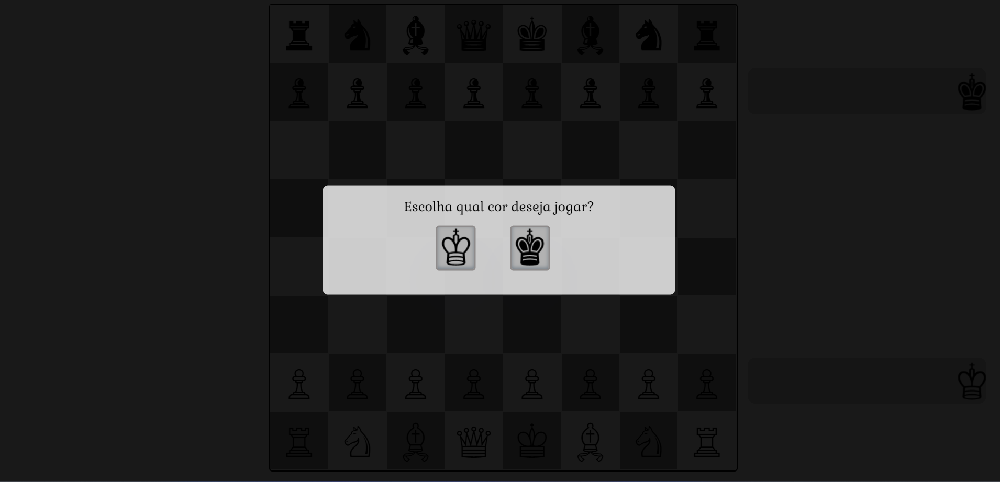
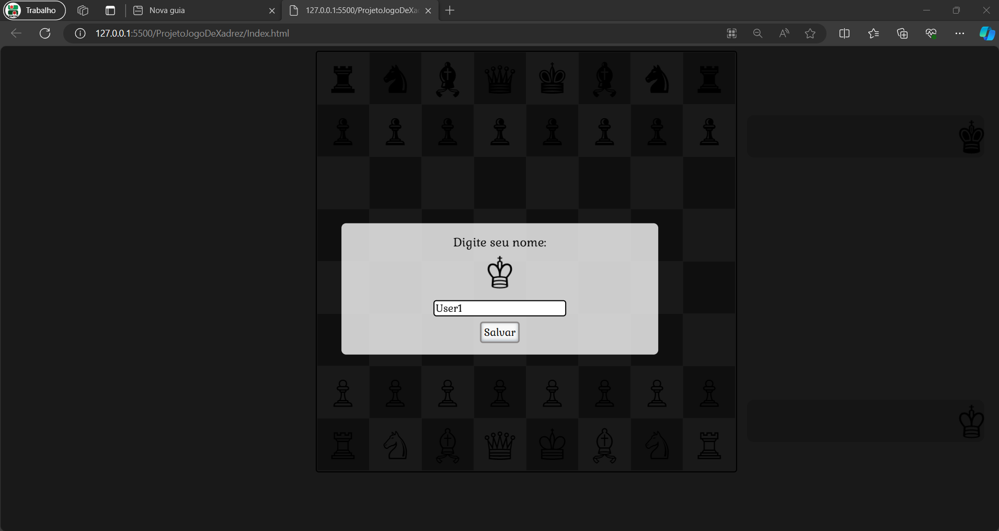
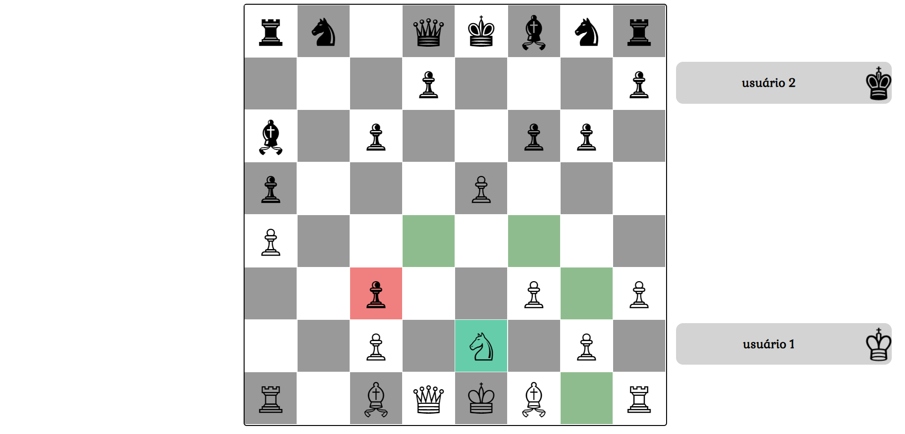
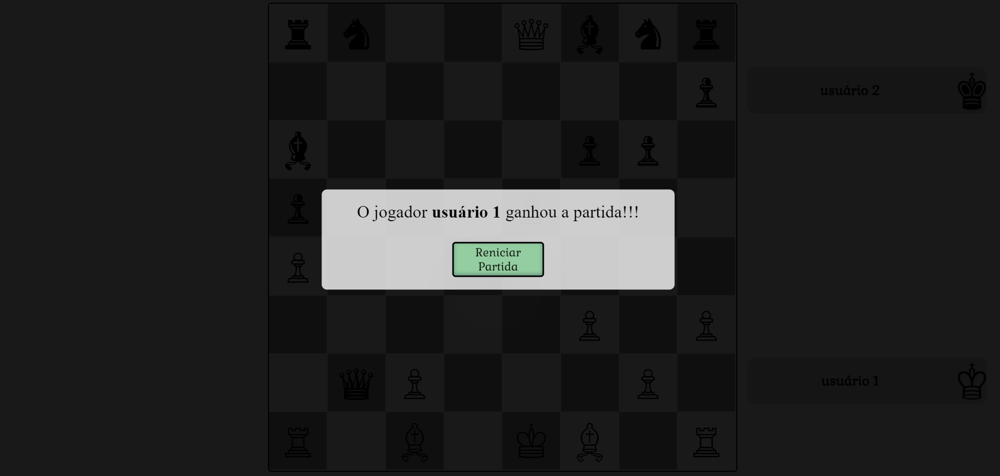

# Projeto Jogo De Xadrez   

Abaixo possui algumas imagens do jogo, que pode ser acessadas abaixo no link

* [Imagem da tela Inicial do jogo](#Imagem-da-tela-Inicial-do-jogo)
* [Imagem durante a partida](#Imagem-durante-a-partida)
* [Imagem da partida final](#Imagem-da-partida-final)

  
## Imagem da tela Inicial do jogo

Na tela inicial, o jogador pode escolher qual cor deseja jogar. Após a escolha da cor, poderá se identificar. Segue abaixo algumas imagens da tela do jogo

  

 

**[⬆ Inicio](#projeto-jogo-de-xadrez---)**

## Imagem durante a partida

O jogo sempre inicia com a cor branca. Ao clicar na peça, será destacado o caminho que a peça pode fazer e se o inimigo estiver no caminho.

 

**[⬆ Inicio](#projeto-jogo-de-xadrez---)**

## Imagem da partida final

A partida se encerra quando o rei sofre o xeque-mate, ou seja, quando a peça do rei é eliminada. Desta forma, o jogo finaliza e o ganhador da partida aparece na tela.

 

**[⬆ Inicio](#projeto-jogo-de-xadrez---)**
